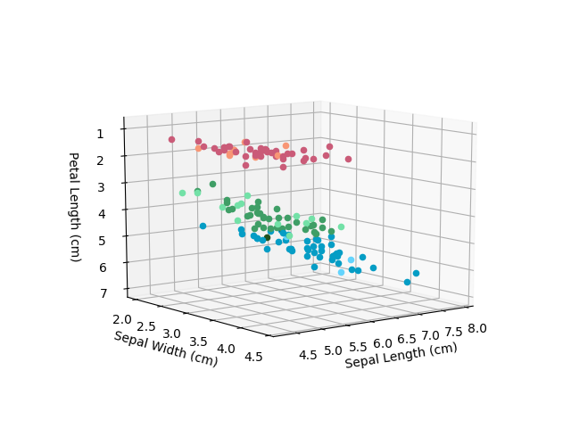

# KthNearestNeighbour
Taking a look at how to implement a kth nearest neighbour classifier.

*Here are the different flowers we might want to classify*

Each colour corresponds to a different flower type. If a plot is a lighter shade of a colour that means that object was correctly predicted to its class. If it is a darker shade of that colour it means it was wrongly predicted to that class.

